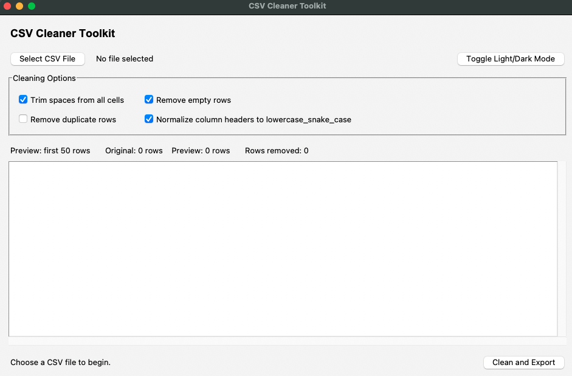
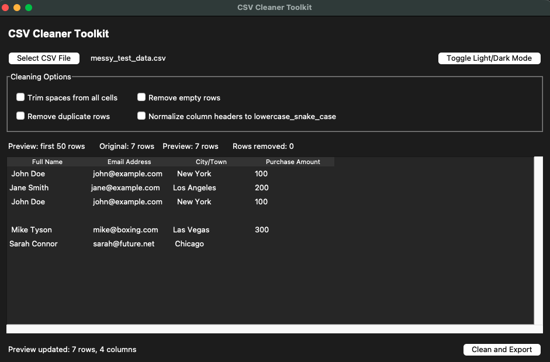
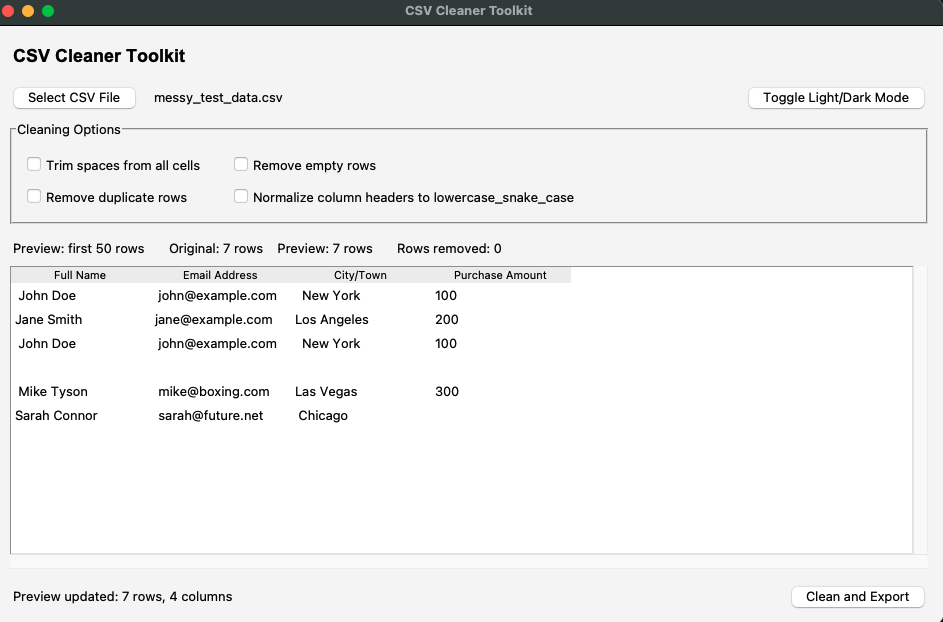
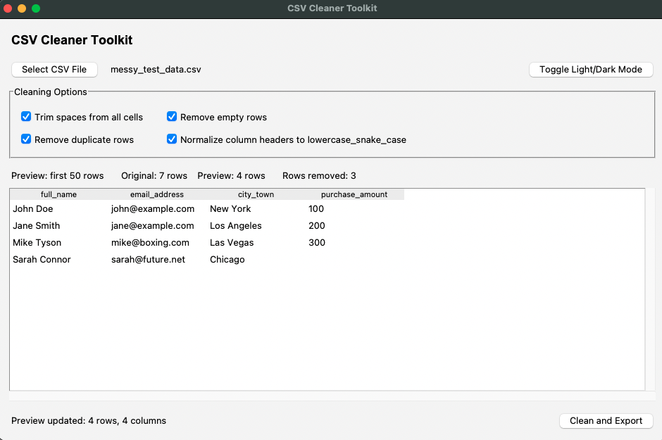
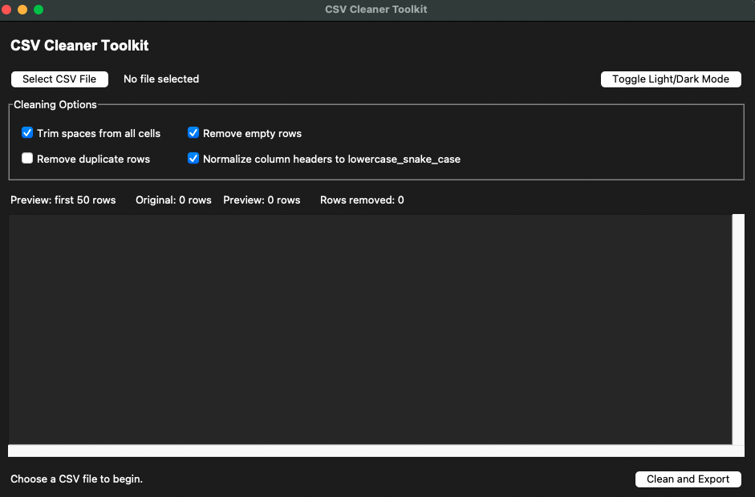
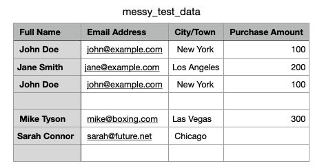
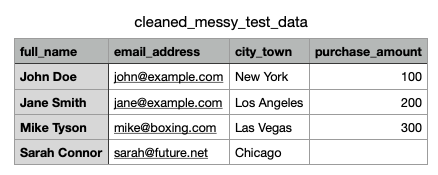

# CSV Cleaner Toolkit

  

  

CSV Cleaner Toolkit is a lightweight offline desktop utility for cleaning messy CSV files quickly and locally.

## Messy CSV Example

## Screenshots

### Main Interface with Dynamic Preview

### Dark / Light Toggle Mode

### Before CSV Cleanup & After CSV Cleanup + Export (Making a new copy)

